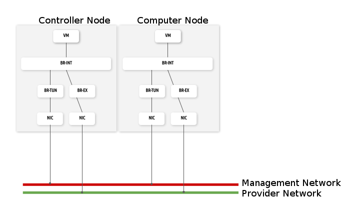
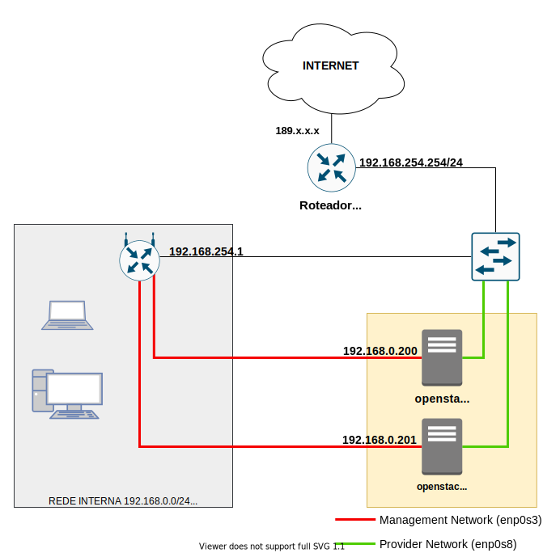
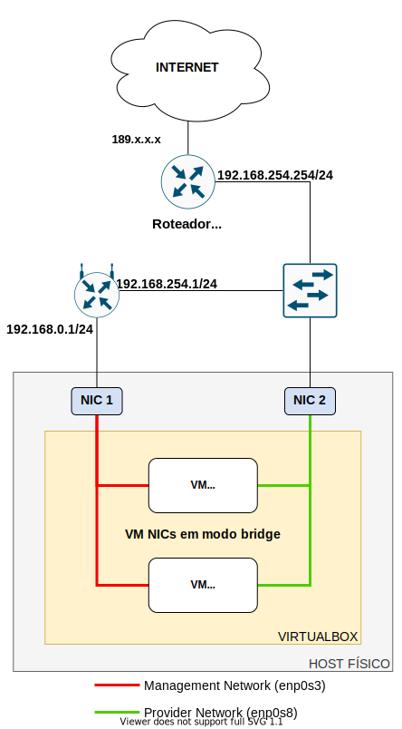
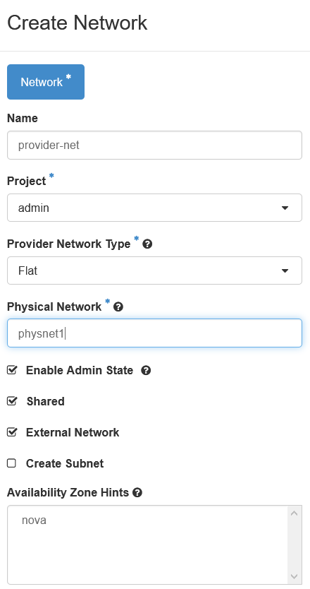
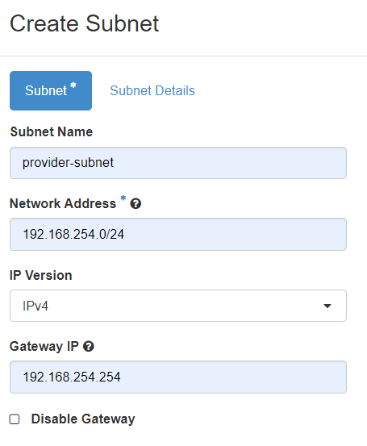
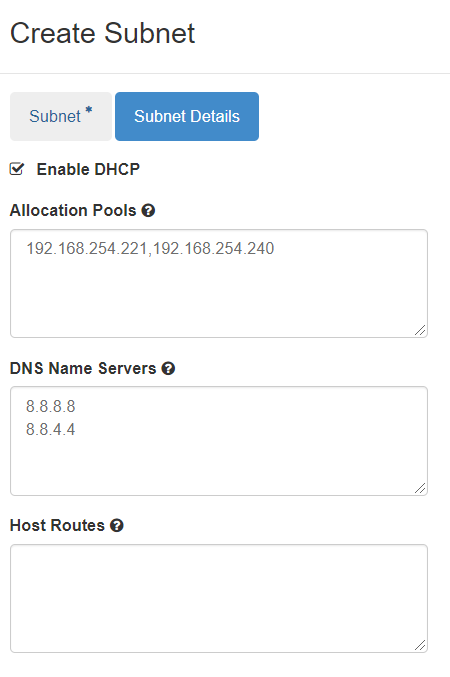
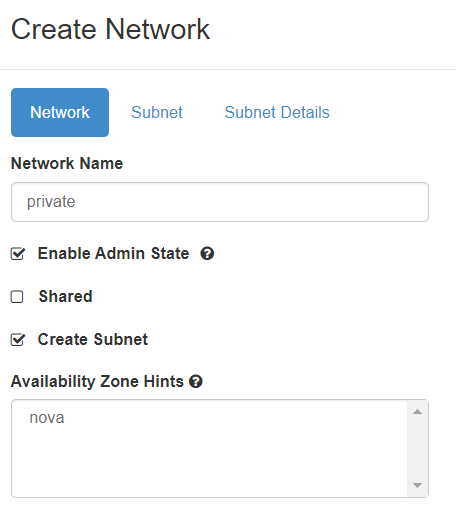
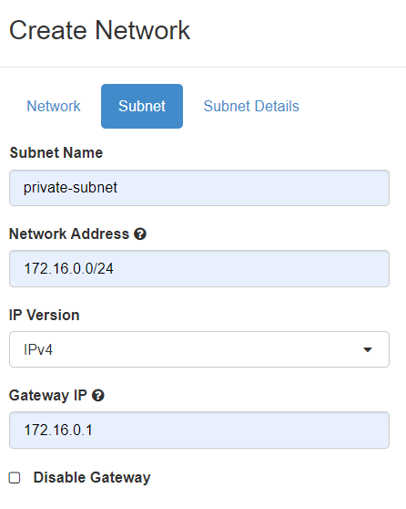
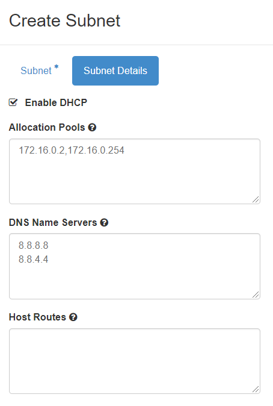

:toc:
:toc-title:

= Instalação do OpenStack Multi-Nó com Kolla-Ansible :cloud:

// settings:
//:idprefix:
//:idseparator: -
//:source-language: ruby
//:language: {source-language}
ifndef::env-github[:icons: font]
ifdef::env-github[]
:status:
:outfilesuffix: .adoc
:caution-caption: :fire:
:important-caption: :exclamation:
:note-caption: :paperclip:
:tip-caption: :bulb:
:warning-caption: :warning:
endif::[]
// Variables:
//:release-version: 2.0
// URIs:
:uri-openstasck-releases: https://releases.openstack.org/

== OpenStack Release: Victoria

https://releases.openstack.org/[OpenStack Releases]

https://docs.openstack.org/kolla-ansible/victoria/[Documentação Kolla-Ansible]
[https://docs.openstack.org//kolla-ansible/victoria/doc-kolla-ansible.pdf[PDF]]

https://docs.openstack.org/kolla-ansible/victoria/user/operating-kolla.html#tips-and-tricks[Kolla-Ansible
Tips and Tricks]

https://docs.openstack.org/ceilometer/victoria/admin/telemetry-measurements.html[Ceilometer
Telemetry Measurements]

https://docs.openstack.org/ceilometer/victoria/install/install-base-rdo.html[Ceilometer
Install RHEL/CentOS]

https://docs.openstack.org/releasenotes/ceilometer/[Ceilometer Release Notes]

https://docs.openstack.org/neutron/victoria/admin/config-mtu.html[MTU
considerations]

Diretórios do repositório::
`arquivos-conf`- contém os arquivos de configuração utilizados na instalação.
`imagens` - contém os diagramas de rede da documentação.

== Limitações

A instalação não cria automaticamente as redes dentro do OpenStack. A configuração deve ser feita de forma manual no Horizon ou pela linha de comando.

== Requisitos mínimos de hardware

* 2 Interfaces de rede
* 8GB Memória RAM
* 40GB Espaço em disco

== Sistema Operacional

* CentOS 8
** Instalação mínima
** Release testada: 8.3.2011
* Sistema de arquivos XFS

== Topologia multinode OpenStack

=== Infraestrutura utilizada

A infraestrutura foi configurada em um ambiente virtual utilizando o VirtualBox
em um host com duas interfaces de rede físicas.

As máquinas virtuais (_controller_ e _compute01_) foram configuradas com duas
interfaces de rede em modo bridge, uma na rede interna (_management_) e outra na
rede do roteador da operadora (_provider_).

[WARNING]
Não foi utlizado Vlan nas redes.

=== Configuração da rede

* Nomes das interfaces devem ser iguais nos nós
* Interfaces:
** *enp0s3*: _Management Network_ - 192.168.0.0/24 (Rede Interna)
** *enp0s8*: _Provider Network_ - 192.168.254.0/24 (Roteador da Operadora)
* IP dos Hosts:
** Nó Controlador: *openstack-controller*
*** _enp0s3_: 192.168.0.200/24
*** _enp0s8_: SEM IP
** Nó de Computação: *openstack-compute01*
*** _enp0s3_: 192.168.0.201/24
*** _enp0s8_: SEM IP
* *Diagrama da rede:*

* *Diagrama da rede no ambiente virtual:*

[WARNING]
====
- No VirtualBox, configurar o Modo Promíscuo nas interfaces de rede das VMs para ``Permitir Tudo'';
- No Hyper-V é necessário habilitar a falsificação de endereço MAC (MAC Spoofing) nas interfaces das máquinas virtuais que estão na rede _provider_;
- Em caso de problema no _pull_ das imagens do docker, verificar o MTU da rede.
====
== 1. Procedimentos comuns a TODOS OS NÓS

:warning: Nota: > Todo o processo de instalação teve como base o usuário _root_
e o diretório _/root/_

=== 1.1 Atualizar o sistema operacional

[source,bash]
----
dnf -y upgrade

# A reinicialização é necessária caso o kernel seja atualizado
reboot
----

=== 1.2 Requisitos básicos

[source,bash]
----
dnf install -y epel-release
dnf config-manager --set-enabled powertools
dnf -y upgrade

## Requisitos Kolla-Ansible
dnf install -y python3-devel libffi-devel gcc openssl-devel python3-libselinux

# (Opcional)
dnf group install -y "Development Tools"

# Utilitários
dnf install -y git python3-pip wget curl telnet wireshark-cli tcpdump net-tools htop dstat nano

python3 -m pip install --upgrade pip
python3 -m pip install --upgrade setuptools
----

=== 1.3 Desabilitar NetworkManager e habilitar network-scripts

[source,bash]
----
dnf install -y network-scripts

systemctl stop NetworkManager.service
systemctl disable NetworkManager.service

systemctl enable network.service
systemctl start network.service
----

=== 1.4 Desabilitar Firewalld

....
systemctl stop firewalld.service
systemctl disable firewalld.service
....

=== 1.5 Desabilitar SELINUX

Editar o arquivo _/etc/selinux/config_ e alterar o parametro SELINUX para
`disabled`.

[source,bash]
----
# Requer reboot
SELINUX=disabled
----

*Reiniciar a máquina para aplicar a alteração*.

=== 1.6 Adicionar hosts no _/etc/hosts_

[source,bash]
----
# controller
192.168.0.200           openstack-controller

# compute
192.168.0.201           openstack-compute01
----

=== 1.7 Configurar a interface da rede provider SEM IP

https://docs.openstack.org/install-guide/environment-networking-controller.html[Configure
network interfaces] (all nodes)

Editar o arquivo _/etc/sysconfig/network-scripts/ifcfg-enp0s8_ e ajustar os
parâmetros de acordo com o exemplo abaixo.

[source,bash]
----
TYPE="Ethernet"
BOOTPROTO="none"
NAME="enp0s8"
UUID=<UUID>
DEVICE="enp0s8"
ONBOOT="yes"
----

*Reiniciar a máquina para aplicar as alterações*.

=== 1.8 Criar o usuário stack

[source,bash]
----
adduser stack
#Senha: stack
echo "stack" | passwd --stdin stack
----

=== 1.9 Adicionar o usuário stack no sudoers

Adicionar a linha abaixo no final do arquivo _/etc/sudoers_

....
stack   ALL=(ALL) ALL
....

=== 1.10 Instalar Ansible na versão 2.9

[source,bash]
----
cd /root
git clone https://github.com/ansible/ansible.git -b stable-2.9
cd ansible
pip3 install .
----

=== 1.11 Instalar Docker

[source,bash]
----
cd /root
curl -sSL https://get.docker.io | bash

systemctl enable docker
systemctl start docker
----

=== 1.12 Configuração do Docker para o Kolla

:warning: *Não necessário para a versões do Docker >= 18.09*

https://docs.docker.com/engine/release-notes/18.09/#18090[Docker 18.09 Reelase]
> A configuração foi removida pelo kolla-ansible durante o deploy.

Criar o arquivo de configuração do kolla no systemd:

[source,bash]
----
mkdir -p /etc/systemd/system/docker.service.d

tee /etc/systemd/system/docker.service.d/kolla.conf <<-'EOF'
[Service]
MountFlags=shared
EOF

systemctl daemon-reload
systemctl restart docker
----

== 2. Procedimentos específicos no CONTROLADOR

:warning: Nota: > Novamente, todo o processo de instalação teve como base o
usuário _root_ e o diretório _/root/_

=== 2.1 Instalar Kolla

[source,bash]
----
cd /root
git clone https://github.com/openstack/kolla -b stable/victoria
cd kolla
pip3 install .
----

=== 2.2 Instalar Kolla-Ansible

[source,bash]
----
cd /root
git clone https://github.com/openstack/kolla-ansible -b stable/victoria
cd kolla-ansible
pip3 install .
----

=== 2.3 Geração da chave ssh e inserção nos nós para os usuários _root_ e _stack_

Para o usuário _root_:

[source,bash]
----
cd /root
ssh-keygen
ssh-copy-id root@openstack-controller
ssh-copy-id root@openstack-compute01
----

Para o usuário _stack_:

[source,bash]
----
# Mudar para o usuário stack
su - stack
ssh-keygen
ssh-copy-id stack@openstack-controller
ssh-copy-id stack@openstack-compute01
# Sair do usuário stack
exit
----

=== 2.4 Configuração do kolla

Copiar os arquivos: - `globals.yml` para `/etc/kolla/globals.yml` -
`passwords.yml` para `/etc/kolla/passwords.yml` - `multinode` para `/root/`

[source,bash]
----
cd /root

# Copia os arquivos globals.yml e passwords.yml para /etc/kolla/
cp -r ./kolla-ansible/etc/kolla /etc/kolla/

# Copia os arquivos de inventário (all-in-one, multinode) na raiz do diretório /root
cp ~/kolla-ansible/ansible/inventory/* .
----

=== 2.5 Geração das senhas do kolla

[source,bash]
----
cd /root/kolla-ansible/tools
python3 generate_passwords.py
----

=== 2.6 Configuração dos hosts para o ansible

Criar o arquivo _/etc/ansible/hosts_ com o seguinte conteúdo.

....
[controller]
openstack-controller

[compute]
openstack-compute01
....

=== 2.7 Alterar as senhas necessárias no arquivo _/etc/kolla/passwords.yml_

[source,bash]
----
# Grafana
grafana_admin_password: grafanaadmin

# Senha do usuário admin para acesso ao Horizon
keystone_admin_password: keystoneadmin
----

=== 2.8 Configurar o arquivo _/etc/kolla/globals.yml_

No arquivo `/etc/kolla/globals.yml`, alterar os parâmetros abaixo.

[source,bash]
----
kolla_base_distro: "centos"
kolla_install_type: "source"
openstack_release: "victoria"
# kolla_internal_vip_address: IP não utilizado na rede (API Interna)
kolla_internal_vip_address: "192.168.0.199"
# kolla_external_vip_address: IP não utilizado na rede provider (API externa) - Caso necessário
#kolla_external_vip_address: "192.168.254.199"
network_interface: "enp0s3"
neutron_external_interface: "enp0s8"

enable_ceilometer: "yes"
enable_gnocchi: "yes"
enable_grafana: "yes"
enable_neutron_provider_networks: "yes"
enable_neutron_sfc: "yes"
enable_redis: "yes"
enable_tacker: "yes"

----

:warning: Notas: >- Em ambiente virtualizado mudar o tipo de virtualização para
QEMU: +
>`nova_compute_virt_type: "qemu"` +
> >- O parâmetro `kolla_internal_vip_address` requer um *IP não utilizado* na
rede. Este IP será o de acesso a API. O Kolla-Ansible não aceitou colocar o
mesmo IP da interface interna. > >- Caso o parâmetro
`kolla_external_vip_address` (IP de acesso externo a API) seja habilitado, nesta
instalação, o IP externo ficará na mesma interface da `rede Management` e o
acesso externo deve ser feito por NAT 1:1. O ideal é configurar o parâmentro
`kolla_external_vip_interface` para separar o tráfego. Porém, no ambiente
testado não foi possível realizar essa configuração devido a limitaçãoes da
rede. > >- Os valores padrões dos outros parâmetros estão descritos nas linhas
comentadas do arquivo.

=== 2.9 Configurar o arquivo _/root/multinode_

No arquivo `/root/multinode`, configurar os grupos de hosts conforme abaixo. Os
demais não são alterados.

....
[control]
localhost

[network]
localhost

[compute]
openstack-compute01 ansible_ssh_user=stack ansible_sudo_pass=stack ansible_become=True ansible_private_key_file=/home/stack/.ssh/id_rsa

[monitoring]
localhost

[storage]
#storage01
....

:warning: Nota: >A instalação não utilizou storage, por isso o host `storage01`
foi comentado e o módulo cinder não foi instalado.

=== 2.10 Checar a configuração do multinode com o ansible

....
ansible -i /root/multinode all -m ping
....

=== 2.11 Revisão da configuração do kolla-ansible e deploy

Foram usados os comandos para `development`.

Para melhores resultados, o item *2.14 Tunning Ansible* mostra alguns parâmetros
de performance do Ansible, que devem ser configurados antes de executar os
comandos abaixo.

:warning: *ATENÇÃO:* >- Caso seja necessário habilitar outros módulos, leia o
*item 8* antes de realizar o _deploy_; >- Para habilitar o TLS, leia o *item 12*
antes de realizar o _deploy_.

[source,bash]
----
# For development:
cd /root/kolla-ansible/tools/
./kolla-ansible -i ../../multinode bootstrap-servers
./kolla-ansible -i ../../multinode prechecks
./kolla-ansible -i ../../multinode pull
./kolla-ansible -i ../../multinode deploy

# post-deployment smoke tests
./kolla-ansible -i ../../multinode check 
# get the admin openrc file (/etc/kolla/admin-openrc.sh)
./kolla-ansible -i ../../multinode post-deploy

# OU

# For deployment or evaluation:
#cd /root
#kolla-ansible -i multinode bootstrap-servers
#kolla-ansible -i multinode prechecks
#kolla-ansible -i multinode pull
#kolla-ansible -i multinode deploy
#kolla-ansible -i multinode check
#kolla-ansible -i multinode post-deploy
----

=== 2.12 Instalar os clientes do OpenStack

Os clientes foram instalados a partir do repositório do próprio CentOS.

[source,bash]
----
# Do repositório CentOS
dnf install centos-release-openstack-victoria
dnf -y upgrade
dnf install python3-openstackclient
dnf install python3-gnocchiclient
dnf install python3-networking-sfc.noarch
----

Para o cliente do Gnocchi funcionar é preciso adicionar a linha baixo no arquivo
OpenRC fornecido pelo Horizon. Ex: `admin-openrc.sh`

[source,bash]
----
export OS_AUTH_TYPE=password
----

:warning: Nota: >- O cliente do Gnocchi instalado via PIP apresentou problemas.
Retornou o erro _``Not Acceptable (406)''_ para o comando `delete`. > >- Para
evitar conflitos, instalar todos os clientes a partir do mesmo repositório. > >-
Caso o pacote `centos-release-openstack-victoria` não esteja disponível,
instalar o repositório RDO com os clientes da release Victoria. +
`dnf install -y https://www.rdoproject.org/repos/openstack/openstack-victoria/rdo-release-victoria-2.el8.noarch.rpm`

=== 2.13 Acessar o Horizon

URL: `http://192.168.0.200`

Usuário: `admin` +
  Senha: `keystoneadmin`

=== 2.14 Tunning Ansible (Opcional)

Para melhores resultados, realizar a seguinte configuração do Ansible antes do
item 2.11 (revisão da configuração e _deploy_).

Criar o arquivo `/etc/ansible/ansible.cfg` com o conteúdo abaixo.

[source,bash]
----
[defaults]
host_key_checking=False
pipelining=True
forks=100
----

A documentação dos parâmentros pode ser encontrada no
https://github.com/ansible/ansible/blob/stable-2.9/examples/ansible.cfg[arquivo
de exemplo do ansible no github].

:warning: Nota: >Esta configuração *não foi realizada* na instalação

== 3. Scripts para automatizar parte dos processos

Os scripts a seguir foram escritos para automatizar ao máximo o processo de
instalação.

* `1-install-common-all-nodes-victoria.sh`
* `2-install-controller-victoria.sh`

=== 3.1 Script `1-install-common-all-nodes-victoria.sh` (para todos os nós)

Este script realiza os procedimentos comuns a todos nós, *exceto* os itens *1.1*
(atualização do SO) e *1.7* (configuração da interface da rede _provider_), pois
são processos que necessitam de reinicialização na máquina

A configuração da interface de rede _provider_ pode ser feita após a execução do
script, e em seguida o host deve ser reiniciado.

Caso os IPs e _hostnames_ sejam diferentes, alterar as seguintes variáveis no
início do script.

[source,bash]
----
CONTROLLER_HOSTNAME="openstack-controller"
CONTROLLER_IP="192.168.0.200"

COMPUTE01_HOSTNAME="openstack-compute01" 
COMPUTE01_IP="192.168.0.201"
----

=== 3.2 Script `2-install-controller-victoria.sh` (para o controlador)

No script, ajustar os hosts conforne necessário nos itens *2.3* e *2.6*.

Este script realiza alguns procedimentos específicos no host controlador. São
executados por este script os itens *2.1 ao 2.6*, e o item *2.12*.

*Deve ser executado após* o script `1-install-common-all-nodes-victoria.sh`.

== 4. Criação das redes no Horizon

=== 4.1 Rede provider

Apenas administradores podem criar redes provider. A rede provider deve ter os
seguintes parâmetros:

* Provider Network Type: `Flat` +
* Physical Network: `physnet1`

`physnet1` é o nome padrão para as redes do tipo _flat_ que o Kolla-Ansible cria
no Neutron. Esse parâmetro pode ser encontrado no arquivo
`/etc/kolla/neutron-server/ml2_conf.ini`:

[source,bash]
----
[ml2_type_flat]
flat_networks = physnet1
----

O mapeamento da `physnet1` para a `br-ex` está no arquivo
`/etc/kolla/neutron-openvswitch-agent/openvswitch_agent.ini`:

[source,bash]
----
[ovs]
bridge_mappings = physnet1:br-ex
----

Que por sua vez, a `br-ex` está conectada na interface `enp0s8` quando foi
atribuída no `globals.yml` através do parâmetro
`neutron_external_interface: "enp0s8"`

A bridge `br-ex:enp0s8` está no openvswitch e pode ser verificada com os
seguintes comandos:

[source,bash]
----
docker exec -it openvswitch_vswitchd bash
ovs-vsctl show
----

Bridge `br-ex` exibida pelo comando `ovs-vsctl show`:

[source,bash]
----
Bridge br-ex
    Controller "tcp:127.0.0.1:6633"
        is_connected: true
    fail_mode: secure
    datapath_type: system
    Port phy-br-ex
        Interface phy-br-ex
            type: patch
            options: {peer=int-br-ex}
    Port br-ex
        Interface br-ex
            type: internal
    Port enp0s8
        Interface enp0s8
----

:warning: Notas: >- Para usuários sem privilégios de administrador possam
utilizar a rede provider, é necessário marcar a opção `Shared`. > >- Caso o
Horizon não crie a rede informando todas as informações das abas (_Network_,
_Subnet_, _Subnet Details_), desmarque a opção `Create Subnet` e crie a subnet
depois.

Capturas de tela:

=== 4.2 Redes privadas

As redes internas (privadas) podem ser criadas pelos usuários, dentro dos
projetos (*Recomendado*).

Ao criar uma rede dentro do projeto, não é exibida a opção
`Provider Network Type`. Por padrão a rede é criada do tipo `VXLAN`, e o
OpenStack atribui automaticante o `Segmentation ID`.

Capturas de tela:

== 5. Roteadores e Instâncias

[source,diff]
----
-TODO
Adicionar prints para criar roteador
----

Com as redes criadas, é preciso criar um roteador para permitir a comunicação
entre as redes.

Posteriormente, pode-se criar as instâncias (máquinas virtuais).

== 6. Grupos de Segurança

A instalação cria apenas um grupo de segurança com o nome `default`. Este grupo
possiu regras apenas para tráfego de saída das máquinas virtuais.

== 7. IPs Flutuantes

Na subnet da rede provider, o parâmetro `Allocation Pools` é utlizadao pelo DHCP
e para fornecer os `Floating IPs`.

O Floating IP funciona mesmo com o DHCP desabilitado, bastando informar o range
de IPs.

== 8. Módulos

Os módulos do OpenStack podem ser habilitados após o _deploy_, porém será
baixada a imagem do docker mais recente do módulo para a release utilizada
(neste caso Victoria).

*É recomendado* habilitar e configurar todos os módulos necessários antes do
_deploy_ (item 2.11), a fim de evitar a utilização de imagens docker com versões
muitos distantes uma das outras, o que pode ocasionar problemas de
compatibilidade entre os módulos.

Para habilitar um módulo após o _deploy_ do ambiente, basta descomentar a linha
referente ao módulo no arquivo `/etc/kolla/globals.yml`, alterar o valor do
parâmetro para `yes` e executar o comando para reconfigurar o ambiente.

*Exemplo:* Habilitar Grafana após o _deploy_.

Editar o arquivo `/etc/kolla/globals.yml`:

[source,bash]
----
#enable_grafana: "no"
enable_grafana: "yes"
----

Definir a senha do grafana no arquivo `/etc/kolla/passwords.yml`:

[source,bash]
----
grafana_admin_password: grafanaadmin
----

Em seguida executar o comando para reconfigurar o ambiente:

[source,bash]
----
# For development:
cd /root/kolla-ansible/tools/
./kolla-ansible -i ../../multinode reconfigure
----

=== 8.1 Ceilometer / Gnocchi - Default Archive Policy

Por padrão o as políticas de arquivo (_Archive Policy_) criadas pelo Ceilometer
no Gnocchi é `low`. Para alterar a política para `high`, deve-se criar os
arquivos de configuração `pipeline.yaml` e `polling.yaml` no diretório
`/etc/kolla/config/ceilometer` seguindo os passos abaixo.

* Criar o diretório `/etc/kolla/config/ceilometer`:
`bash   mkdir -p /etc/kolla/config/ceilometer`
* Criar o arquivo `/etc/kolla/config/ceilometer/pipeline.yaml`: +
Este arquivo pode ser obtido
https://github.com/openstack/ceilometer/blob/stable/victoria/ceilometer/pipeline/data/pipeline.yaml[neste
link] ou no diretório `arquivos-conf/ceilometer/` deste repositório. +
Editar o arquivo e alterar o endereço do Gnocchi no `publishers:` para: +
`bash   #- gnocchi://   - gnocchi://?archive_policy=high` O parâmetro
`archive_policy=high` foi adicionado a partir da release Rocky, podendo ser
verificado
https://docs.openstack.org/releasenotes/ceilometer/rocky.html#relnotes-11-0-0-stable-rocky-upgrade-notes[neste
link]
* Criar o arquivo `/etc/kolla/config/ceilometer/polling.yaml`: +
O conteúdo deste arquivo pode ser obtido
https://github.com/openstack/ceilometer/blob/stable/victoria/etc/ceilometer/polling.yaml[neste
link] ou no diretório `arquivos-conf/ceilometer/` deste repositório. +
Editar o arquivo e alterar o parâmetro `interval:` para `1` segundo: +
`bash   ...   # Intervalo em segundos   #interval: 300   interval: 1   ...`

Após a criação dos arquivos, realizar o _deploy_ no item 2.11 ou, caso o
OpenStack já esteja operacional, realizar a reconfiguração com o comando abaixo.

[source,bash]
----
# For development:
cd /root/kolla-ansible/tools/
./kolla-ansible -i ../../multinode reconfigure
----

As métricas com _Archive Policy_ `high` serão criadas para as novas instâncias.
As instâncias existentes permanecerão com a política `low`.

:warning: Nota: > Na configuração do `pipeline.yaml`, a release Victoria
adiciona o parâmetro `filter_project=service`. Foi configurado com a
documentação da Release Rocky, posteriomente foi vista a documentação da Release
Victoria. Mas não foi encontrada diferenças entre as configurações na
documentação. > -
https://docs.openstack.org/releasenotes/ceilometer/rocky.html#relnotes-11-0-0-stable-rocky-upgrade-notes[Release
Rocky]: `gnocchi://?archive_policy=high` > -
https://docs.openstack.org/ceilometer/victoria/install/install-base-rdo.html#install-and-configure-components[Release
Victoria]: `gnocchi://?filter_project=service&archive_policy=low`

== 9. Adicionar um Nó de Computação

Os nomes das interfaces de rede devem ser iguais aos demais nós.

Host: *openstack-compute02* - Interface *enp0s3*: 192.168.0.202/24
(_Management_) +
- Interface *enp0s8*: 192.168.254.202/24 (_Provider_)

Passos:

* Seguir os procedimentos do *item 1*, comuns a todos os nós.
* Adicionar o host `openstack-compute02` no `/etc/hosts` de todos os nós.
* No controlador, exportar as chaves SSH (usuários _root_ e _stack_) para o host
`openstack-compute02`, conforme o *item 2.3*
* No controlador, adicionar o host `openstack-compute02` nos arquivos abaixo
dentro da chave *[compute]*. *Itens 2.6 e 2.9* respectivamente.
** `/etc/ansible/hosts`
** `/root/multinode`

Por fim, no controlador, realizar o deploy do nó de computação com o usuário
`root`.

Assim como no item *2.11*, foram utilizados os comandos para `development`. O
parâmetro `--limit` executa o comando apenas para o host informado.

[source,bash]
----
# For development:
cd /root/kolla-ansible/tools/
./kolla-ansible -i ../../multinode bootstrap-servers --limit openstack-compute02
./kolla-ansible -i ../../multinode prechecks --limit openstack-compute02
./kolla-ansible -i ../../multinode pull --limit openstack-compute02
./kolla-ansible -i ../../multinode deploy --limit openstack-compute02
----

:warning: Notas: >- Ao adicionar um nó posteriormente, pode ser que este nó
utilize imagens do Docker mais recentes do que as utilizadas no outros nós, pois
ao executar o comando de `pull`, as imagens são novamente baixadas do Docker
Hub. *Não é recomendado* executar versões diferentes nos nós. > >- O Kolla tem o
recurso de registro local do Docker para fazer cache das imagens, como mostra a
https://docs.openstack.org/kolla-ansible/victoria/user/multinode.html[documentação
multinode (Deploy a registry)]. +
Porém, esse recurso *não foi utlizado*. Durante o `pull` as imagens foram
baixadas novamente do Docker Hub.

== 10. Remover um Nó de Computação

[source,diff]
----
-TODO
----

== 11. Atualizar as imagens docker da release instalada

Para atualizar as imagens docker dos módulos do OpenStack, seguir os segintes
passos.

[arabic]
. Parar os conteiners:
`bash  # For development:  cd /root/kolla-ansible/tools/  ./kolla-ansible -i ../../multinode stop --yes-i-really-really-mean-it`
. Fazer o pull das imagens: `bash  ./kolla-ansible -i ../../multinode pull`
. Fazer o upgrade: `bash  ./kolla-ansible -i ../../multinode upgrade`
. Remover as imagens antigas:
`bash  ./kolla-ansible -i ../../multinode prune-images --yes-i-really-really-mean-it`

== 12. TLS

https://docs.openstack.org/kolla-ansible/victoria/admin/tls.html[Documentação
TLS]

:warning: *É recomendado habilitar o TLS antes de realizar o _deploy_ (item
2.11)*.

Ao habilitar o TLS, o acesso ao Horizon e à API passa a ser feito pelo IP
`kolla_internal_vip_address` e `kolla_external_vip_address`, neste caso, o NAT
de acesso externo deve ser apontado para o IP `kolla_external_vip_address`, e
este deve ser configurado com o IP válido do NAT.

Por padrão o Kolla-Ansible gera os certificados com validade de 01 (um) ano
dentro do diretório `/etc/kolla/certificates/`. Para que os certificados sejam
gerados com validade superior a 01 (um) ano, deve-se alterar o parâmetro `-days`
nos arquivos abaixo. Nesta instalação o parâmetro `-days` foi definido em 3650
(10 anos) em todos os arquivos.

* `/root/kolla-ansible/ansible/roles/certificates/tasks/generate-root.yml`
* `/root/kolla-ansible/ansible/roles/certificates/tasks/generate-backend.yml`
* `/root/kolla-ansible/ansible/roles/certificates/tasks/generate.yml`

:warning: Nota: >`generate-root.yml` : Certificado raiz. +
>`generate-backend.yml` : Certificado para comunicação ente HAProxy (API
interface) e os serviços do OpenStack. +
>`generate.yml` : Certificado para acesso ao Horizon e a API.

Para habilitar o TLS, configurar os parâmetros abaixo no arquivo
`/etc/kolla/globals.yml`:

[source,bash]
----
kolla_enable_tls_internal: "yes"
kolla_enable_tls_external: "yes"
kolla_copy_ca_into_containers: "yes"

# Certificado raiz gerado pelo kolla em /etc/kolla/certificates/ca/root.crt
# Este certificado deve ser fornecido aos clientes para ser inserido no arquivo OpenRC através do parâmetro OS_CACERT=
kolla_admin_openrc_cacert: "root.crt"

#If deploying on Debian or Ubuntu:
#openstack_cacert: "/etc/ssl/certs/ca-certificates.crt"

#If on CentOS or RHEL:
openstack_cacert: "/etc/pki/tls/certs/ca-bundle.crt"

kolla_enable_tls_backend: "yes"
# Não verifica o certificado self-signed
kolla_verify_tls_backend: "no"
----

Executar os seguintes comandos:

[source,bash]
----
cd /root/kolla-ansible/tools/

# Gera o certificado self-signed
./kolla-ansible -i ../../multinode certificates
----

Caso o _deploy_ já tenha sido feito, reconfigurar o ambiente com o comando
abaixo. Caso contrário, voltar ao item 2.11 para fazer o _deploy_.

[source,bash]
----
# Reconfigurar o ambiente caso o deploy já tenha sido feito
./kolla-ansible -i ../../multinode reconfigure
----

:warning: Nota: > Como dito nas notas do item 2.8 (arquivo globals.yml), esta
instalação não separou as interfaces da API interna e externa. Dessa forma ao
acessar a API externamente, ocorrerá falha na verificação do certificado, pois o
IP externo será diferente do IP interno. Neste caso, deve-se adicionar o
parâmetro `--insecure` na linha de comando dos clientes do OpenStack. O
parâmetro `--insecure` desabilita a verificação do certificado.

== 13. Upgrade de versão

[source,diff]
----
-TODO
----

== 14. Destruir a nuvem

:warning: *CUIDADO!*

O comando abaixo remove os conteiners docker do OpenStack. +
Após o comando de _destroy_ é necessário um novo _deploy_.

[source,bash]
----
 cd /root/kolla-ansible/tools/

./kolla-ansible -i ../../multinode destroy --yes-i-really-really-mean-it
----

== 15. Estudos e configurações futuras

* Configurar MTU para Jumbo Frames;
* Colocar o `kolla_external_vip_address` na interface da rede `provider`. Para
separar o tráfego interno/externo à API;
* Utilizar nomes de domínio e certificados válidos;
* Adicionar um host como storage. Possibilitando o teste de migração das VMs
entre os nós de computação;
* Processo de backup das VMs.
